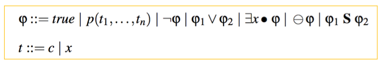
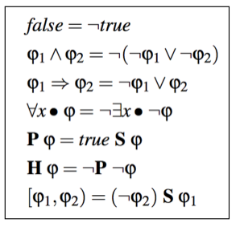
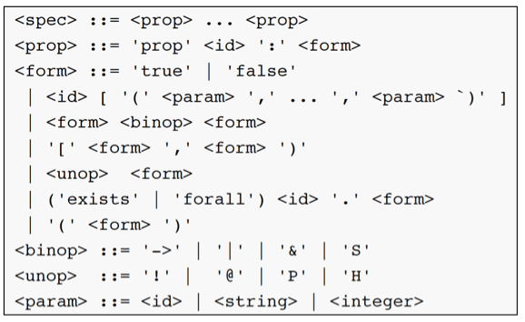

# DejaVu

## Author: Klaus Havelund, Doron Peled, Dogan Ulus
## Description

DejaVu is a newly developed tool for monitoring past first order temporal logic (i.e., first
order safety properties). It was developed by Klaus Havelund (NASA/JPL), Doron Peled (Bar Ilan)
and Dogan Ulus (Verimag). It is based on BDD representation. The values appearing
in the input are enumerated, and the BDD represents the relationship between the data
values, according to their appearance in the monitored sequence and the tested temporal
formula. It allows the use of infinite domains of values, by encoding a special value for "all the
rest of values not seen", whose relationship to other values is maintained during the monitoring.
The BDD can be expanded dynamically when more space is needed. Initial experiments show
very efficient behavior. 

## Syntax

The syntax of formulas in the core logic, and the definition of derived operators, 
are as follows (forming part of the theory of DejaVu):

The actual grammar for writing full specifications in ASCII format is as follows:

## The Login, File, and Queue Study

To illustrate the logic, we will specificy properties about a computer system, on which users can log in and out, where files can be opened and closed, and then accessed (reading or writing), and where queues are used to temporally store data.

## Some Properties

Below is a list of properties we want to hold over traces of such events.

- **P1.** *If a file is accessed by a user, then the user should have
logged in and not yet logged out, and the file should have
been opened and not yet closed.* 

- **P2.** *If a file is closed, then it must have been opened (and not
yet closed) with some mode m (e.g. read or write).* 

- **P3.** *A datum can at most enter a queue once and can 
at most exit once. The queue should behave as FIFO (First In First Out).*

## Formalized in DejaVu

The three properties can be formalized as follows. 

~~~
prop P1 :
  forall u . forall f .
    access(u,f) ->
      [login(u),logout(u))
        &
      [open(f),close(f))

prop P2 : forall f . close(f) -> exists m . @ [open(f,m),close(f))

prop P3 :
 forall x .
  (enter(x) -> ! @ P enter(x)) &
  (exit(x) -> ! @ P exit(x)) &
  (exit(x) -> @ P enter(x)) &
  (forall y . (exit(y) & P (enter(y) & @ P enter(x))) -> @ P exit(x))
~~~

A property of the form ``[P,Q)`` is short for ``!Q S P`` (not ``Q`` since ``P``), and is true
on an interval where ``P`` has been observed true in the past and since then ``Q`` has not been observed true.
This operator was inspired by the MaC logic from U. Penn. Concerning property **P2**, there is an existential quantification over the access mode: read or write.

## Evaluation of Dejavu

### Pros

* BDDs seem for efficiency reasons a promising representation of data observed in a trace. It is, however, currently not clear how well they perform compared to slicing, which is considered very fast.

* Properties are very elegant to express.

* The logic is expressive in that arbitrary alternations of universal and existential quantification is allowed.

### Cons

* Due to the fact that data in the trace are mapped to BDDs, it becomes non-obvious how to interpret data operations on formulas. For example it is non-trivial to compare data values beyond equality and it becomes non-trivial to apply functions to observed data values to obtain new values. However, the slicing approaches, such as found in MOP e.g., seem to suffer from the same limitations. Solving this problem is future work.

## References & links

* URL: [https://github.com/havelund/tracecontract/tree/master/dejavu](https://github.com/havelund/tracecontract/tree/master/dejavu)
* [*First Order Temporal Logic Monitoring with BDDs*](fmcad-2017.pdf), Klaus Havelund, Doron Peled, and Dogan Ulus,  17th Conference on Formal Methods in Computer-Aided Design (FMCAD 2017), 2-6 October, 2017, Vienna, Austria. IEEE, 2017, pp. 116-123.  
* [Slides](FMCAD.pptx)

