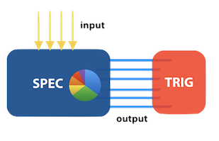

# LOLA
## Authors: [Bernd Finkbeiner](https://www.react.uni-saarland.de/people/finkbeiner.html), [Hazem Torfah](https://www.react.uni-saarland.de/people/torfah.html)


## Description
LOLA is a specification language and stream processing engine for monitoring temporal properties and computing complex statistical measurements. LOLA specification are stream-based: input streams, which contain sensor readings and data collected at runtime, are translated into output streams. Output streams contain aggregate statistics and logical conditions on the values of input and newly computed output streams.    

An overview of the LOLA framework is given by the following diagram  
<p> 

</p>

A LOLA specification is a set of equations of stream expressions over typed stream variables. Stream expressions can be constants, arithmetic operations, boolean conditions and more. LOLA also includes offset expression for accessing the values of streams in past and future time steps. Furthermore, LOLA allows for the defintion of trigger streams, that define thresholds and other logical conditions on the values of output streams, and raise an alarm or execute some other predefined action if the condition becomes true. 

LOLA comes with following features:
* Parameterization
* Dynamic stream invocation
* Real-time sliding-windows

## Example: Shopping Platform

The following LOLA specification alerts the owner of a shopping platform whenever a product has been granted a rating of five stars more than 100 times:

```c
input int prodId
input int rating

output int fiveStars<int id>
    invoke: prodId
    extend: id=prodId && rating=5
     := fiveStars(id)[-1,0]+1

trigger any(fiveStars > 100)
```
The specification defines a monitor that observes two inputs, the product identification number in the stream prodId, and the products' ratings in the input stream rating. 

Every time a new product is observed with identification number id, a new instance fiveStars(id) of the template fiveStars is invoked. Afterwards, every time the product id is rated with five stars, the instance fiveStars(id) is extended with a new value, which is the value computed so far incremented by 1. If the value of any of the invoked instances fiveStars(id) exceeds 100, i.e., if more than 100 users rated the corresponding product with five stars, then the monitor sends out an alert.


LOLA also supports aggregations over real-time sliding-windows. Consider the following extension of the shopping platform example, where we want to pointout high demand products: 
```c
output int salesFreq <int id>
    invoke: prodId
    extend: prodId = id
    := prodId[1h, 0, count(id)]

trigger any(salesFreq > 100)
```
An instance of the template salesFreq computes the number of times a prodcut id has been sold in the last hour. In each computation step, the aggregation fucntion count(id), which counts the appearences of the product id, is applied to the sequence of values of the stream prodId that were added to tthe stream in the last hour. If a product has been sold more than 100 times in the last hour, the owner of the platform is alerted. 

## Prototype
The tool is available as a pre-compiled binary for MacOS X and Linux. For MacOS a working Swift 4 environment is required, for Linux the necessary environment can most easily be obtained via a Docker container [here](https://hub.docker.com/_/swift/).

Lola supports integers, doubles, booleans, strings and arbitrary tuples thereof natively. Data for the input streams can be provided by a CSV file for offline monitoring, or from the standard input allowing online monitoring. After parsing the specification, the monitor processes the data. Here, each line represents the arrival of new data. This especially means that the input arrival frequency does not have to be constant, but arbitrarily much real time may pass between new arrivals. Whenever the input data leads to the condition for a trigger being satisfied, a respective message is printed on the standard error output reporting appropriate information about the current state of the monitor. 
For real-time specifications, the monitoring algorithm refers to the timestamps of input data. 
### Limitations
* The current implementation does not support future references, yet.
* The implementation is restricted to a predefined set of aggregation functions.  
* Does not support self-defined datatypes and functions.

For more on the usage of the tool, check out the [LOLA](https://www.react.uni-saarland.de/tools/lola/) webpage. 
## Specifications from Case Studies
### UAS
In this specification we validate the output of the navigation part of the sensor fusion in unmanned aerial systems (UAS). 
GPS signal jumps are computed by the Haversine formula (given by stream a). It compares the traveled distance, first by using  the velocity values received by the IMU unit, and second by computing the distance as measured by the GPS coordinates. All calculations are performed in Lola and compared against a threshold. Since the formula expects the latitude and longitude in radians and we receive them in decimal degree, we convert them first.

```c
input  double lat, lon, ug, vg, wg, time_s, time_micros

output double time := time_s + time_micros / 1000000.0 

output double velocity := sqrt( ug^2.0 + vg^2.0 + wg^2.0 )
const  double R        := 6373000.0
const  double pi       := 3.1415926535

output double lon1_rad := lon[-1,0.0] * pi / 180.0
output double lon2_rad := lon * pi / 180.0
output double lat1_rad := lat[-1,0.0] * pi / 180.0
output double lat2_rad := lat * pi / 180.0
	
output double dlon     := lon2_rad - lon1_rad
output double dlat     := lat2_rad - lat1_rad
output double a := (sin(dlat/2.0))^2.0  +  
                    cos(lat1_rad) * 
                    cos(lat2_rad) * 
                   (sin(dlon/2.0))^2.0
output double c := 2.0 * atan2( sqrt(a), sqrt(1.0-a) )
output double gps_distance := R * c

output double passed_time     := time - time[-1,0.0]
output double distance_max    := velocity * passed_time
output double dif_distance    := gps_distance - distance_max
const  double delta_distance  := 1.0
output bool   detected_jump   := switch position { 
                                 case 0 { false } 
                                 default {dif_distance   
                                            > delta_distance } }
```
This case study was done in collaboration with the German Aerospace Center ([DLR](http://www.dlr.de/dlr//en/desktopdefault.aspx/tabid-10002/)). 
### TCP SYN-Floods
The following LOLA specification describes one monitor for detecting SYN-Flood attacks: 

```c
input string Prot, Src, Dst, Syn, Ack

output (string,string) handshakeInv
     extend: Prot ="TCP" & Syn="Set" & Ack="Not Set" 
     := (Src,Dst)

output int waitForAck<src,dst>
    invoke: handshakeInv
    terminate: src=Src & dst=Dst & Syn="Not Set" & Ack="Set" 
    := waitForAck(src, dst)[-1,0]+1

output (string,string) tcpSynInv<src, dst>
	invoke: handshakeInv; 
	extend: waitForAck(src,dst)[0,0] > threshold1 
	terminate: waitForAck(src,dst)[0,0] > threshold1 
	:= (src,dst)

output int tcpSynScan<src,dst>
    invoke: tcpSynInv
    extend: src=Src & dst=Dst & Syn="Set"
    terminate: src=Src & dst=Dst & Syn="Not Set" & Ack="Set"
    := tcpSynScan(src,dst)[-1,0] + 1
 
trigger any(tcpSynScan > threshold2)
```

### Amazon ratings
```c
frequency 0.1 Hz
input string uid, pid
input double stars

output double stars_by_prod <string prod>
	invoke: pid
	extend: pid = prod
    := stars
    
output double star_avg_l <string prod>
    invoke: pid
    := stars_by_prod(prod)[100s, average, 0.0]
    
output double star_avg_s <string prod>
    invoke: pid
    := stars_by_prod(prod)[10s, average, 0.0]
    
output double avg_delta <string prod>
    invoke: pid
    := star_avg_l(prod)[0, 0.0] - star_avg_s(prod)[0, 0.0]
    
trigger any(avg_delta > 1.0)
```
## References & links

* https://www.react.uni-saarland.de/tools/lola/
* [LOLA: Runtime Monitoring of Synchronous Systems](https://www.react.uni-saarland.de/publications/DSS+05.html)
* [A Stream-based Specification Language for Network Monitoring](https://www.react.uni-saarland.de/publications/FFST16.html)
* [Stream Runtime Monitoring on UAS](https://www.react.uni-saarland.de/publications/AFFST17.html)
* [Towards Intelligent System Health Management using Runtime Monitoring](https://www.react.uni-saarland.de/publications/TAFS17.html)
