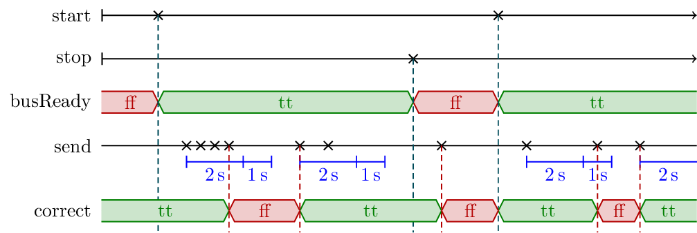

## TeSSLa

The Temporal Stream-based Specification Language (TeSSLa) operates on asynchronous real-time streams. It was first created for specifying properties about programs running on multi core systems and it is currently used and developed in the [COEMS](https://www.coems.eu) project.

## Author: Torben Scheffel

In case of any questions do not hesitate to contact [Torben](http://www.isp.uni-luebeck.de/staff/scheffel).

## Example: Finding bursts

TeSSLa can be seen as a stream processing language. In the following example we detect bursts of input events in a certain time frame:

```ruby
in send: Events<Unit>
in start: Events<Unit>
in stop: Events<Unit>

# Specify burst property: Up to 3 events are allowed during burst length of 2 seconds.
# During the waiting period of 1 second immediately after the burst period no events are allowed.
def property :=
  bursts(
    send,
    burstLength = 2s,
    waitingPeriod = 1s,
    burstAmount = 3
  )

# The communication is ready between start and stop
def busReady := defined(start) && default(time(start), 0) > default(time(stop), 0)

# If the communication bus is not ready, then no events are allowed.
# If the bus is ready, then events must follow the burst pattern defined above.
def correct := if !busReady
  then noEvent(send, since = falling(busReady))
  else property

# Outputs
out busReady
out correct
```

(Note that we only use ruby syntax highlighting because GitHub supports it and it is syntactically close enough to TeSSLa.)

You can find the full specification in [`bursts.tessla`](bursts.tessla).

The idea of the specification above is depicted in the following diagram:



The [input trace `bursts.input`](bursts.input) contains exactly those events shown in the diagram above:

```
$timeunit = "ms"
2000: start
3000: send
3500: send
4000: send
...
```

As declares by the `$timeunit` annotation the timestamp before the colon is in milliseconds. The event after the colon contains no data, so the name of the event is enough.

The [monitoring output `bursts.output`](bursts.output) looks as follows

```
$timeunit = "ms"
0: busReady = false
0: correct = true
2000: busReady = true
2000: correct = false
3000: correct = true
3500: correct = true
4000: correct = true
...
```

TeSSLa consists of only six basic operators and a huge macro system, which allows to write specifications as the one above. For example the macro `eventCount` (which is used for the definition of `bursts`, see the full specification in [`bursts.tessla`](bursts.tessla)) is defined only using basic operators as follows:

```ruby
# Count the number of events on `values`. Reset the output to 0
# on every event on `reset`.
def eventCount(values, reset) := {
  def count := default(
    # `reset` contains the latest event
    if default(time(reset) > time(values), false)
    then 0
    # `reset` and `values` latest events happen simultaneously
    else if default(time(reset) == time(values), false)
    then 1
    # `values` contains the latest event --> increment counter
    else last(count, values) + 1
  , 0)
  count
}
```

The parts of the standard library used in the specification given above is included in the [`bursts.tessla`](bursts.tessla).

## Application Example: Data race detection

Data races occur in multi threaded programs when two or more threads access the same memory location concurrently, at least one of the accesses is for writing, and the threads are not using any exclusive locks to control their accesses to that memory. The C program [`race.c`](race.c) is an example of a race prone program. 

```c
#include <stdio.h>
#include <pthread.h>
#define LOOPS 100

int x = 0;

void* count1(void *arg) {
    for ( int i = 0; i < LOOPS; i++ ) {
        x++; 
    }
    return NULL;
}

void* count2(void *arg) {
    for ( int i = 0; i < LOOPS; i++ ) {
        x++; 
    }
    return NULL;
}

int main() {
    pthread_t p1, p2;
    pthread_create( &p1, NULL, count1, NULL );
    pthread_create( &p2, NULL, count2, NULL );
    pthread_join(p1, NULL);
    pthread_join(p2, NULL);
    printf( "Counted %d\n", x );
    return 0;
}
```

Here we have two threads, both calling the functions that should count up to 100. Since there are no synchronization mechanisms between threads on the shared variable `x` a data race is present. For example, let us assume that the current value of `x` is 5. One thread may read the current value of `x`, but before this thread increments `x`, the other thread may also read the same value. Then, both threads may store 6 in `x`. Such situations happen any time both threads read the same value. So, the final value of `x` may vary in each run.

If the file [`race.trace`](race.trace) contains the trace of one execution of the C code, with the [TeSSLa specification `race.tessla`](race.tessla) given bellow, we can do two things. First, we can issue an event in the `dataRace` stream when we detect that two threads are reading the shared variable and at least one of them is writing. Second, we can issue an event in the `badInterleave` stream when we detect that the threads have indeed interleaved in such a way that the value of the shared variable is corrupted. An event in dataRace is issued regardless of whether threads interleave correctly or not in the current execution. 

```ruby
# observation specification
def thread1_reads := load_exec(line_number = 9)
def thread2_reads := load_exec(line_number = 16)
def thread1_writes := store_exec(line_number = 9)
def thread2_writes := store_exec(line_number = 16)

# are threads reading or writing at all?
def one_thread_reads := thread1_reads || thread2_reads
def two_threads_read := thread1_reads && thread2_reads
def one_thread_writes := thread1_writes || thread2_writes

# if two threads are reading a variable which is written by one thread,
# we found a potential data race
def dataRace := two_threads_read && one_thread_writes
out dataRace

# for more concrete results look at the time stamps
def time_read := time(one_thread_reads)
def time_write := time(one_thread_writes)

# if the time stamp of second to last read is greater than the time stamp of the last write,
# then two reads happened without a write in between --> bad interleave
def badInterleave := if last(time_read) > default(time_write, 0) then ()
out badInterleave
```

The [output of the monitoring `race.output`](race.output) looks as follows

```
...
101931087340755: dataRace = true
101931087602506: dataRace = true
101931087720298: badInterleave = ()
101931087720298: dataRace = true
101931087727045: dataRace = true
101931087729066: dataRace = true
101931088065216: dataRace = true
101931088094015: badInterleave = ()
101931088094015: dataRace = true
101931088161967: dataRace = true
...
```

## The Specification Language TeSSLa

TeSSLa can express a lot of different properties like real time properties, reasoning about sequential executions orders, calculating and comparing statistics and so on. From the beginning on, TeSSLa was built in a way that the generated monitors can be synthesized and executed in hardware (more concrete: FPGAs) such that we are able to still process even huge amounts of data online by exploiting the high parallelism of the hardware. This led to a very specific set of basic functions, but these functions can be efficiently rebuild in hardware.

Furthermore, the goal was that industry software engineers are able to understand and write TeSSLa specifications easily. Hence, TeSSLa is equipped with a strong macro system such that we are able to define a huge standard library on top of the basic functions so software engineers can use TeSSLa. It is easy to define new functions based on existing ones if needed. With this standard library it is also feasible to use TeSSLa for creating software monitors, which might also reason about objects, because the very specific basic operators defined for efficiently creating hardware monitors are not needed to write specifications (neither for hardware nor for software monitors). Of course, for complete freedom you might want to use them, but for most of the general use cases, it is not necessary.

Of course, some features are still missing in TeSSLa that are desirable for a specification language. High level data domains would be a possible addition to TeSSLa. Currently, streams can only have simple data domains as types like integers, rational numbers, strings and so on. But data domains like sets, queues or maps would be an interesting addition. Such data domains in TeSSLa would enable us to do quantification in specifications and remember an arbitrary amount of values for later usage. But the addition of something like this needs a distinction between hardware and software monitors. In software, those data types can just be used. But for hardware monitors it is necessary to not allow general sets, queues and maps but restricted versions of those to allow quantification and memorization of values to some extend such that the specification can still be synthesized efficiently on hardware.

## References & links

* https://www.coems.eu
* http://www.isp.uni-luebeck.de/tessla
